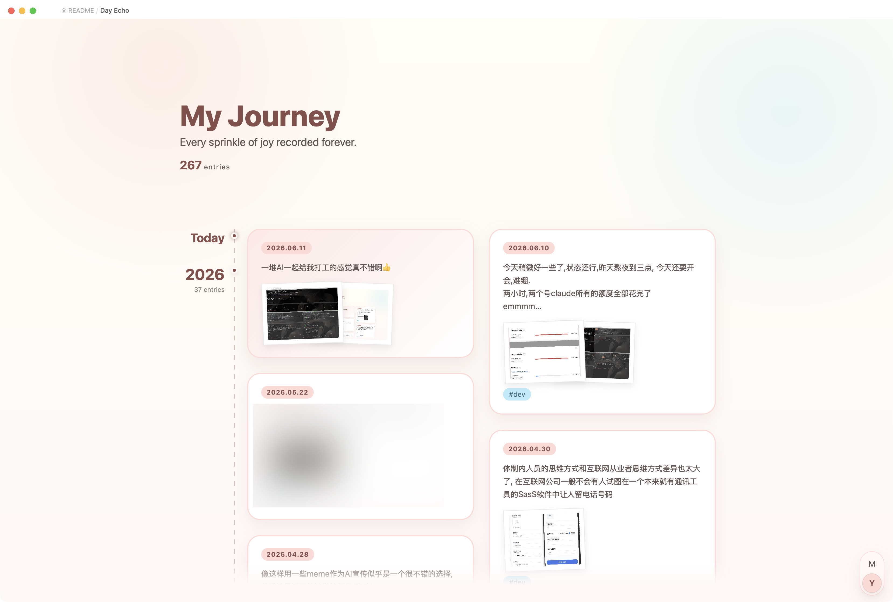

# Day Echo

> Gather all your daily notes into one vertical timeline view.

Day Echo is an [Obsidian](https://obsidian.md) plugin that turns your scattered daily notes into a single, scrollable timeline — so you can scan months and years of journaling at a glance, reopen any day in a click, and keep writing without losing the thread.

<!-- Add a screenshot or GIF of the timeline here. -->




## Features

### Vertical timeline

Collects every daily note in your diary folder into one continuous, two-column timeline:

- A left-hand axis marks each section (month or year), with a running entry count.
- Cards flow newest-first (or oldest-first) and are balanced across two columns.
- A sticky label pins the current section to the top as you scroll, and a **back-to-top** button slides in once you've scrolled past one full screen.
- The top of the timeline shows a small "My Journey" header with your total entry count.

Open it from the **calendar** ribbon icon on the left, or via the command palette: **Open Day Echo timeline**.

### Rich cards

Each day is rendered as a preview card:

- A text snippet of the note (frontmatter, code, and images stripped out).
- Lazy-loaded image thumbnails in a stacked, polaroid style — full-size images decode off the critical path so scrolling stays smooth.
- The note's tags (excluding the `#daily` marker).

Click a card to open the full day's note in a **modal popup**; click the date label to open the note in the editor.

### Month / Year zoom

A floating segmented control in the bottom-right corner switches between **month** and **year** aggregation:

- Click a segment, or hold **Ctrl / Cmd / Alt** and scroll the wheel to zoom in or out.
- Zooming plays a smooth crossfade and keeps the section under your cursor anchored in place.
- In year view, only representative entries are shown per year, with a **"show more"** card to expand the rest.

Plain wheel scrolling is replaced by an eased, speed-capped glide for a calmer reading feel. (Both effects respect your system's *reduce motion* setting.)

### Today shortcut

When viewing newest-first, the top of the timeline always reflects today:

- If today's note already exists, it appears as a highlighted card under a "today" marker.
- If it doesn't, a **"start today's diary"** card creates and opens the note for you.

### Daily-note navigation bar

When you open any date-named daily note (`YYYY-MM-DD`), Day Echo injects a **previous / next** bar at the bottom of the note, so you can step through adjacent days without leaving the editor. This can be toggled off in settings.

### Energy & mood block

Drop an `echo-interaction` code block into any note to rate a day's **energy** and **mood** on a 1–5 scale. Saving writes the scores into that day's daily-note frontmatter (`energy` / `mood`):

````markdown
```echo-interaction
date: yesterday
```
````

`date` accepts `yesterday` (default), `today`, or an explicit `YYYY-MM-DD`.

The timeline refreshes automatically whenever notes in the diary folder are created, modified, renamed, or deleted.

## Settings

| Setting | Description |
| --- | --- |
| **Daily notes folder** | Folder scanned for daily notes, relative to the vault root. Default: `daily`. |
| **Oldest first** | Default sort direction. Off (default) shows the newest entries at the top. |
| **Show diary navigation** | Show the previous / next bar on top of open daily notes. |

Day Echo treats notes named `YYYY-MM-DD.md` inside the daily folder as diary entries.

## Installation

### From within Obsidian (once published)

1. Open **Settings → Community plugins** and disable Restricted Mode.
2. Click **Browse**, search for **Day Echo**, and install it.
3. Enable the plugin.

### Manual

1. Download `main.js`, `manifest.json`, and `styles.css` from the latest release.
2. Copy them into `<your-vault>/.obsidian/plugins/day-echo/`.
3. Reload Obsidian and enable **Day Echo** in **Settings → Community plugins**.

Requires Obsidian `1.5.7` or newer. Works on both desktop and mobile.

## Development

```bash
pnpm install
pnpm dev      # watch + rebuild
pnpm build    # type-check + production build
pnpm test     # run the unit tests (vitest)
```

## License

[MIT](LICENSE)
