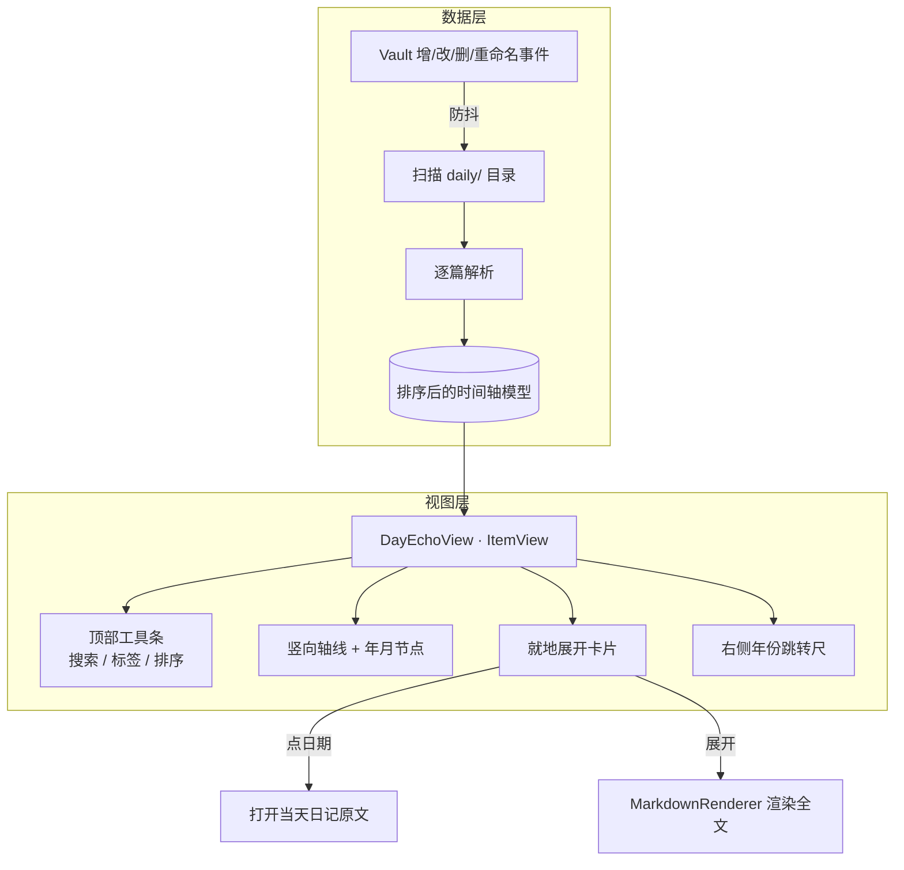

# Day Echo 时间轴视图 设计方案

> 状态：已确认，待编写实现计划
> 日期：2026-06-10

## 1. 目标

把 vault 中所有日记（`daily/` 下 268 篇 `YYYY-MM-DD.md`）汇聚到一个页面，用**竖向时间轴**呈现，支持沉浸式回看与基础找路。这是 Day Echo 插件的第一个功能。

非目标（本期不做）：

- 「那年今日」历史回响功能（确认推迟，后续迭代再加）
- 在时间轴内编辑日记（编辑仍回到原文）
- 虚拟滚动（268 篇暂不需要，量大后再加）

## 2. 已确认的产品决策

| 维度 | 决策 |
| --- | --- |
| 整体形态 | **竖向时间轴**：左侧贯穿轴线，年/月做节点，日记卡片挂在轴一侧 |
| 页面载体 | **插件自定义视图（ItemView）**，ribbon 图标 + 命令面板打开，独占标签页 |
| 节点信息量 | **就地展开**：默认轻量预览，点击在原地展开全文，再点收起 |
| 找路能力 | 年份快速跳转、标签筛选、关键词搜索（三项均做） |
| 跳转原文 | 点日期节点 → 打开当天日记原文 |

## 3. 架构总览



## 4. 数据层

### 4.1 日记来源识别

- 扫描设置项指定的日记文件夹（默认 `daily/`）。
- 判定为日记：文件名匹配 `YYYY-MM-DD.md`，或带 `daily` 标签。
- 日期取值优先级：文件名中的日期 > frontmatter `created`。

### 4.2 每篇解析出的字段

```
DiaryEntry {
  date:        Date          // 排序与节点用
  file:        TFile         // 跳转原文用
  previewText: string        // 去除图片/代码块后的纯文本，用于折叠态预览与搜索
  images:      string[]      // 已解析为 vault 资源路径的图片
  tags:        string[]      // 内联标签 + frontmatter 标签
}
```

### 4.3 图片解析

需同时识别三种写法，统一解析为可渲染的资源路径：

- `imgs` 代码块内的 ``（image-cluster 插件用法）
- 标准嵌入 `` 与 ``
- Obsidian 嵌入 `![[x.webp]]`

通过 `app.metadataCache` / `app.vault.getResourcePath` 把相对/绝对路径解析为实际资源。

### 4.4 响应式刷新

监听 `vault` 的 `create` / `modify` / `delete` / `rename` 事件，防抖（约 300ms）后对受影响文件做增量更新，时间轴自动反映改动，无需手动重建。

## 5. 视图层

### 5.1 视图注册

- 自定义 `ItemView`，视图类型 `day-echo-timeline`。
- 通过 ribbon 图标与命令面板「打开 Day Echo 时间轴」激活；已存在则聚焦，不重复创建。

### 5.2 布局

- 左侧贯穿的轴线，**年份节点**（实心高亮）+ **日期节点**（空心小点）。
- 卡片挂在轴右侧。
- 顶部工具条：搜索框、标签多选、排序方向切换。
- 右侧年份快速跳转尺，点击滚动到对应年份。
- 默认排序：最新在上（设置项可切换为最早在上）。

### 5.3 卡片两态

- **折叠态**：单行/两行纯文本预览（`previewText` 截断）+ 图片缩略缩略图，超出折叠为「+N」；图片用 `IntersectionObserver` 懒加载，避免一次性拉取全部图片。
- **展开态**：点击就地展开，用 Obsidian `MarkdownRenderer.renderMarkdown` 渲染当天完整 Markdown，图片与链接按原生方式显示。展开内容按需渲染（首次展开才渲染）。
- 点日期节点：调用 workspace 打开当天日记原文。

### 5.4 找路交互

- **搜索**：输入防抖后过滤 `previewText` 命中的条目。
- **标签筛选**：多选标签，过滤包含所选标签的条目。
- **年份跳转**：右侧尺点击滚动定位。
- 三者可叠加生效。

## 6. 性能策略

- 折叠态预览开销极小，268 篇可全量渲染骨架。
- 重开销（全文 Markdown 渲染、图片加载）全部按需触发：图片懒加载，全文仅在展开时渲染。
- 初版不引入虚拟滚动；当条目规模显著增长导致 DOM 过重时再评估引入。

## 7. 设置项

| 设置 | 默认 | 说明 |
| --- | --- | --- |
| 日记文件夹 | `daily` | 扫描来源 |
| 默认排序方向 | 最新在上 | 可切换为最早在上 |

## 8. 项目脚手架

当前仓库仅有 README，需要补齐 Obsidian 插件基础：`manifest.json`、`main.ts`、`package.json`、`tsconfig.json`、esbuild 构建配置、`styles.css`。

## 9. 模块边界

- **数据层（scanner / parser）**：输入 vault，输出 `DiaryEntry[]`；不碰 DOM，可独立测试。
- **视图层（DayEchoView + 渲染组件）**：输入 `DiaryEntry[]` 与筛选状态，输出 DOM；不直接读文件。
- **插件入口（main）**：注册视图、命令、ribbon、设置，连接数据层与视图层。

清晰的输入输出边界让数据解析逻辑可单测，视图可独立演进。
