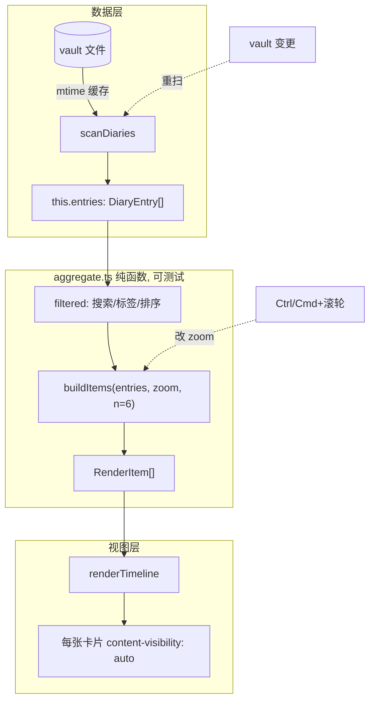

# Timeline 缩放与丝滑滚动 设计

created: 2026-06-10

## 目标

让 Day Echo 时间线在 1-2k 篇日记规模下滚动丝滑,并支持用 Ctrl/Cmd + 滚轮在三个档位之间缩放:

- **天**:每篇日记一张卡(现状)
- **月**:按月分组,每月精选 6 篇,其余折叠
- **年**:按年分组,每年精选 6 篇,其余折叠

## 核心设计决策

### 决策 1:缩放不重扫,只重聚合

缩放时日记内容(文字、图片、标签)不变,变的只是分组粒度和显示数量。因此缩放**绝不调用 `scanDiaries`**,只对内存中已有的 `this.entries` 重新聚合并重绘。

两条触发路径分离:

- **vault 变更 / 打开视图** → `scanDiaries`(带 mtime 缓存)→ 更新 `this.entries` → 重聚合 + 重绘
- **缩放 / 搜索 / 标签 / 排序** → 不重扫,直接 `filtered → buildItems → renderTimeline`

### 决策 2:用 `content-visibility: auto` 做虚拟化

在 1-2k 篇这个量级,瓶颈是屏幕外变高卡片的 layout/paint,而非 DOM 节点数。给每张卡片行加 `content-visibility: auto` + `contain-intrinsic-size`,浏览器自动跳过视口外卡片的布局与绘制。

- 保留"全部卡片进 DOM"的现有结构,改动小
- 天然支持变高卡片(无需自己维护高度缓存)
- 与现有图片 `IntersectionObserver` 懒加载叠加
- 退路:若未来涨到 10k+,迁移到真·虚拟列表(窗口化 + 节点回收)

## 架构



## 组件与文件

| 文件 | 改动 |
|---|---|
| `src/types.ts` | 新增 `ZoomLevel = "day" \| "month" \| "year"`、`RenderItem` 类型 |
| `src/aggregate.ts` | 新增。纯函数 `buildItems(entries, zoom, n)`,含有图优先选篇逻辑。不碰 DOM |
| `src/scanner.ts` | 新增 `Map<path, {mtime, entry}>` 解析缓存 |
| `src/view.ts` | 缩放状态、Ctrl/Cmd+滚轮处理(含光标锚定)、渲染分发(卡片/分组头/折叠)、crossfade |
| `src/settings.ts` | 持久化当前档位 `zoom` |
| `styles.css` | content-visibility、分组头、折叠占位、crossfade、缩放光标反馈 |

## 数据模型:RenderItem

`buildItems` 把 `DiaryEntry[]` 转成一串渲染项:

```ts
type RenderItem =
  | { kind: "year"; year: number }                    // 天视图的大年份分隔
  | { kind: "group"; key: string; label: string }     // 月/年视图的分组头
  | { kind: "card"; entry: DiaryEntry }               // 一张日记卡
  | { kind: "fold"; key: string; hidden: DiaryEntry[] } // "+N 篇" 折叠占位
```

各档位产出:

- **天**:遇到新年份插 `year` 分隔,然后每篇一个 `card`(等价现状)
- **月**:每个年月一个 `group` 头 + 精选 6 篇的 `card` + 一个 `fold`(若有剩余)
- **年**:每年一个 `group` 头 + 精选 6 篇的 `card` + 一个 `fold`(若有剩余)

## 选篇规则:有图优先 6 篇

组内选篇逻辑(`n = 6`):

1. 组内分两堆:**有图的**(`entry.images.length > 0`)和 **纯文字的**
2. 先从"有图的"按日期取,不足 6 篇再用"纯文字的"补满
3. 选出的 6 篇**仍按日期顺序显示**(选时优先图,排时按时间,不乱序)
4. 未入选的进 `fold`,显示 `+N 篇`

## 交互

### Ctrl/Cmd + 滚轮缩放

- 在 `listEl` 挂 `wheel` 监听(`passive: false`)
- 仅当按住 Ctrl/Cmd 时 `preventDefault` 并触发缩放,否则正常滚动
- 方向:向上滚 = 变细(往天走),向下滚 = 变粗(往年走);档位顺序 `天 → 月 → 年`
- 加 delta 阈值 + ~250ms 冷却,一次手势只跳一档

### 光标锚定缩放

- 缩放前:记下光标 Y 位置下最近的日期,以及该元素相对视口顶部的偏移
- 重绘后:找到代表该日期的元素(天视图为该篇卡,月/年视图为其所属分组头),回设 `scrollTop` 让它停在光标原来的位置
- 效果:缩放时视图不跳,围绕光标处缩放

### 切档过渡

- 重绘时给列表加一个 ~150ms 透明度 crossfade
- 不逐卡片动画(开销大)

### 折叠展开

- 点击 `+N 篇`:**在原地展开该组全部剩余卡片**,其他组不变
- 通过就地 DOM 插入实现,不触发整表重绘

## 性能细节

### content-visibility

- 加在卡片行(`de-row`)上,分组头不加
- `contain-intrinsic-size` 按"纯文字 / 带缩略图"给两档高度估算值,避免滚动条跳动

### mtime 解析缓存

- `scanner.ts` 维护 `Map<path, {mtime, entry}>`
- vault 变更重扫时,`file.stat.mtime` 未变的文件直接复用上次解析的 `DiaryEntry`,跳过正则与纯文本提取
- 扫描结束后清理已删除文件对应的缓存项

## 状态持久化

- 当前档位 `zoom` 存入 settings(沿用 `sortAscending` 的模式)
- 重开视图保持上次档位

## 错误处理与边界

- 空结果:沿用现有"No matching entries"提示
- 某组少于 6 篇:全部显示,不产生 `fold`
- 缩放到边界档位(天再放大 / 年再缩小):无操作,不报错
- 图片解析失败:沿用现状,跳过该图

## 测试

- 项目当前无测试框架
- 给纯函数模块加轻量 `vitest`,**只测 `aggregate.ts`**:`buildItems` 的分组、有图优先选篇、6 篇上限、fold 生成、各档位顺序
- 交互(滚轮缩放、光标锚定、crossfade、折叠展开)与渲染靠手动验证

## 不做(YAGNI)

- 不做连续无级缩放(只三档)
- 不做真·虚拟列表(content-visibility 足够,留作未来退路)
- N 固定为 6,不做成可配置项
- 不为交互层写自动化测试
